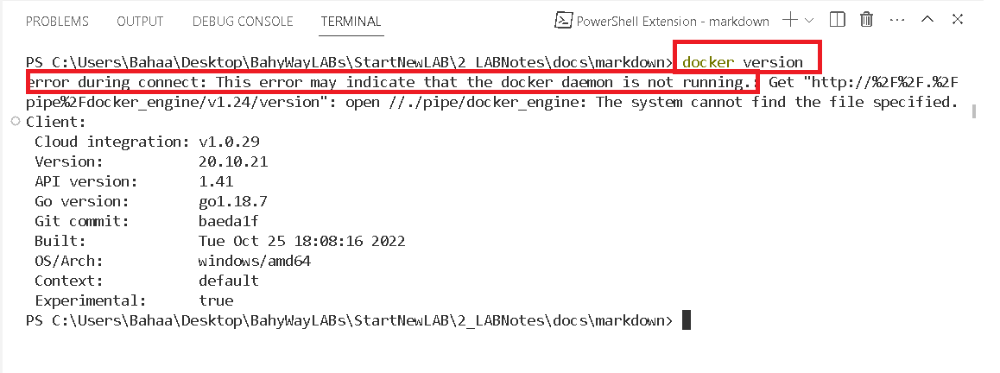

# **_prerequisites_**

I need the following to be installed on my Laptop befor ***Building any New Development LAB*** using VSCode , Docker & GitHub:
1. ***Chocolatey*** &/Or ***Scoop***, to Automate  and Silently install all other needed apps.
   1. Using **_Scoop_** means creating optionally My Own **_Scoop Bucket_** incase the needed apps in the Project doesn't already found in ***Official Scoop Buckets*** or any other ***Extra Scoop Buckets***.
   2. Using **_Chocolatey_** needs ***Administrator*** Privileges.

```powershell
$psversiontable.psversion.major # should be >= 5.0
```

> ***Note***: 
Make sure you have PowerShell 5.0 or later installed. If you're on Windows 10 or Windows Server 2012 you should be all set, but Windows 7 and Windows Server 2008 might have older versions.

Make sure you have allowed PowerShell to execute local scripts:

```powershell
set-executionpolicy remotesigned -scope currentuser
```
## ***Using Scoop***

1. <spin style="color:blue">**_Installing Scoop to Custom Directory_**</spin>

Assuming the target directory is ``C:\scoop``, in a PowerShell command console, run:

```scoop
mkdir "C:\scoop"
$env:SCOOP='C:\scoop'
[environment]::setEnvironmentVariable('SCOOP',$env:SCOOP,'User')
Invoke-WebRequest -useb get.scoop.sh | Invoke-Expression
```
Although Scoop is written in PowerShell, its interface is closer to Git and Mercurial than it is to most PowerShell programs.

To get an overview of Scoop's interface, run:
```scoop
scoop help
```
You'll see a list of commands with a brief summary of what each command does. For more detailed information on a command, run scoop help <command>, e.g. scoop help install (try it!).

Now that you have a rough idea of how Scoop commands work, let's try installing something.

```scoop
scoop install curl
```
***Finding apps***

Let's say you want to install the ssh command but you're not sure where to find it. Try running:
```scoop
scoop install ssh
```
You'll should see a result for 'openssh'. This is an easy case because the name of the app contains 'ssh'.

You can also find apps by the name of the commands they install. For example,
```Scoop
scoop search hg
```
This shows you that the 'mercurial' app includes 'hg.exe'.

***Updating Scoop***
To get the latest version of Scoop you have to run the command
```scoop
scoop update --all
```
> **_NOTE_**
>
>There is ***NO way*** to test if scoop exists (I couldn't  find one till now), so to re-run a ***Scoop Script*** , I need to remove scoop and re-install it again:
```scoop
# Uninstalling Scoop
scoop uninstall scoop
# Broken Install
del .\scoop -Force
```


1. ***Git*** for ***Scoop***.
2.  ***VSCode*** for running ***Scoop*** and/or ***Chocolatey*** scripts that will install any other needed to install apps for your project on your own Laptop &/or within Docker Container.
3. ***GitHub*** New Account for Creating ***New Repository***.
4. ***Git Bash*** for connecting to ***GitHub*** from command line of your local machine.
5. ***GitHub Desktop*** for connecting to ***GitHub Repository*** and ***VSCode*** from your local machine.
6. ***Docker Desktop*** to connect to Docker containers localy.
```scoop
scoop install docker
```
Then Check to see if **_Docker_** is running, use the shell and write:
```cmd
docker version
```
If **_Docker_** is not running you will get an <spin style="color:red"> ***Error*** </spin>:



8. ***VScode GitHub Extensions*** & ***VSCOde Docker Extensions*** to connect to both apps from ***VSCode***.

<spin style="color:red"> ***Install Remote Container Extension in VSCode*** </spin>
```bash
code --install-extension ms-vscode-remote.vscode-remote-extensionpack
code --install-extension ms-vscode-remote.remote-ssh
```

## **_Terms_**

***Shim***

In computer programming, a shim is a library that transparently intercepts API calls and changes the arguments passed, handles the operation itself or redirects the operation elsewhere.[1][2] Shims can be used to support an old API in a newer environment, or a new API in an older environment. Shims can also be used for running programs on different software platforms than they were developed for.

Shims for older APIs typically come about when the behavior of an API changes, thereby causing compatibility issues for older applications which still rely on the older functionality; in such cases, the older API can still be supported by a thin compatibility layer on top of the newer code. Shims for newer APIs are defined as: "a library that brings a new API to an older environment, using only the means of that environment


### ***References***
[Quick Start](https://github.com/ScoopInstaller/Scoop/wiki/Quick-Start#installing-scoop-to-custom-directory)
