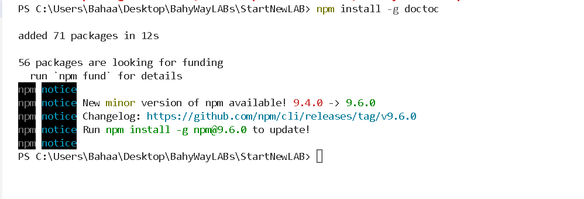

# **_Add Table of Contents to Markdown_**

When you are writing tutorials that are broken up by sections it is nice to have a table of contents at the top to help the users navigate. However, maintaining this by hand is a no go. Luckily there is a great npm package called doctoc that will look at the headings in your markdown file and generated a table of contents for you.

## **_Installing_**

```npm
npm install -g doctoc
```


## **_Adding to All Files_**
```doctoc
doctoc .
```
## **_Add to Single File_**
```doctoc
doctoc /path/to/file [...]
```
***examples***
```doctoc
doctoc README.md

doctoc CONTRIBUTING.MD LICENSE.MD
```
## **_Skipping Files_**

There is no built-in mechanism out of the box for doctoc to skip certain files from having a table of contents. However you can add a comment to each file and then use a little bit of command line logic to exclude those files. Below are examples using Ack and out-of-the-box Windows commands.

The first step is to add this line of text to the markdown files to skip of:
```doctoc
<!-- DOCTOC SKIP -->
```


### **_References_**
[Add Table of Contents to Markdown](https://digitaldrummerj.me/adding-toc-to-markdown/)